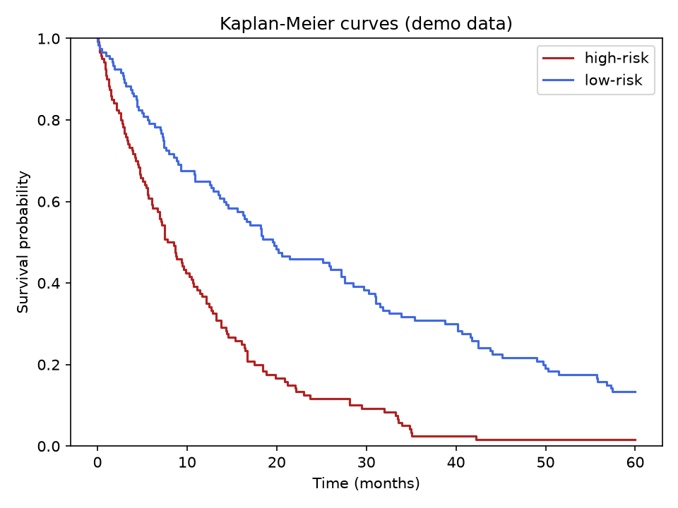

# Kaplan Meier Survival Curves

A gene is high in aggressive tumours — but does it actually shorten survival? The Kaplan-Meier curve is how you find out, and how clinicians read prognosis off a chart.

## Why This Matters

Survival data is censored: many patients are still alive at last follow-up, so you cannot simply average survival times. Kaplan-Meier estimates the probability of survival over time while properly handling that censoring. When two groups' curves pull apart, that gap is the visual signature of a prognostic factor.

## How It Works

1. Sort the event times.
2. At each death, step the survival probability down by the fraction still at risk.
3. Draw a step curve for each group.

## What the Demo Shows



The demo simulates a high-risk and a low-risk group with different event rates. The curves separate clearly — the high-risk group's survival falls away faster — which is exactly what a meaningful prognostic marker looks like.

## Run It

```bash
pip install -r requirements.txt
python demo.py
```

> Demonstrated on synthetic data, so the whole thing is reproducible with no external downloads.
